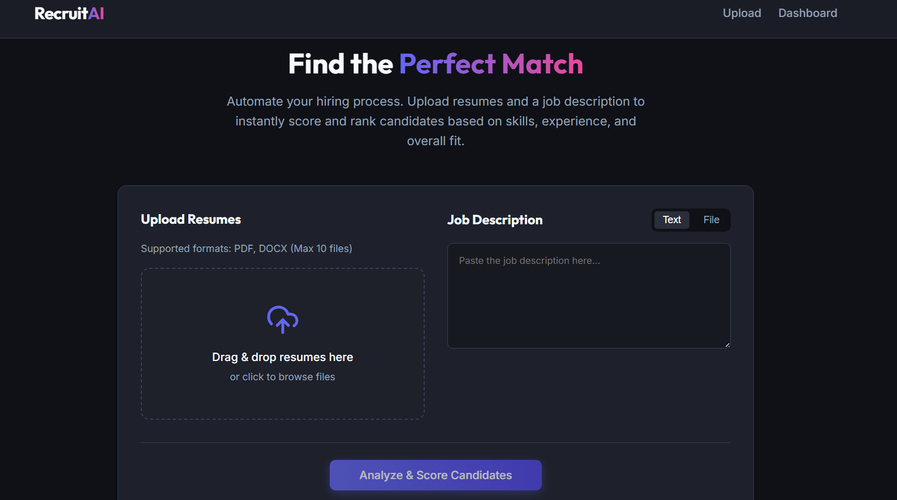

<div align="center">
  <br />
    <h1 align="center">AI Resume Screening & Candidate Ranking Web Application</h1>

<br />

<div>

</div>

</div>


## <a name="introduction">✨ Introduction</a>
he AI Resume Screening & Candidate Ranking application is a full-stack web tool designed to streamline the hiring process for HR professionals and recruiters. By automating the initial screening phase, the application allows users to upload multiple candidate resumes and a specific Job Description (JD). The system leverages advanced Generative AI to parse the documents, analyze the semantic match between the candidates' qualifications and the job requirements, and output a ranked dashboard of candidates based on their suitability.

## 🎯 Live Demo
Live Application URL: https://resume-screener-ashy.vercel.app/

## ✨ Features

- **Multi-format Resume Upload**: Supports batch uploading of candidate resumes in `.pdf`, `.doc`, and `.docx` formats via a drag-and-drop interface.
- **Job Description Input**: Allows recruiters to either paste a text-based JD or upload a JD document.
- **AI-Powered Analysis**: Utilizes Google's Gemini AI to semantically evaluate candidates instead of relying on rigid keyword matching.
- **Scoring & Ranking**: Assigns an overall match score (0-100) to each candidate and automatically ranks them from highest to lowest fit.
- **Skill Breakdown**: Extracts and displays specific matching skills the candidate possesses, as well as missing skills required by the JD.
- **Interactive Dashboard**: A responsive, premium UI to view rankings, search for specific candidates, delete records, and preview original resume files.
- **Export Capabilities**: Export the final ranked candidate list to a CSV file for external reporting and sharing.


## 📚 Technologies Used
 
### Frontend
- **Framework**: Next.js (App Router), React 18
- **Styling**: Vanilla CSS for a highly customized, premium, glass-morphism aesthetic.
- **Icons**: Lucide React

### Backend
- **Runtime**: Node.js, Express.js
- **File Handling**: Multer for intercepting multipart form data and temporarily storing files locally.
- **Text Extraction**: `pdf-parse` (for PDFs) and `mammoth` (for DOCX files).
- **AI Integration**: `@google/generative-ai` SDK (using the Gemini Flash/Pro models).

### Database
- **Database Engine**: PostgreSQL (Neon Cloud DB)
- **ORM**: Prisma (for schema modeling and database migrations)

<br>

## 🏗 Architecture Overview
The project is decoupled into two primary directories:
1. `/frontend`: A Next.js application that handles the user interface, client-side routing, file selection, and API communication.
2. `/backend`: A Node.js API server that acts as the orchestration layer.

## **Workflow:**
1. The Frontend sends the selected resumes and JD to the Backend `/api/upload` endpoint via `multipart/form-data`.
2. The Backend uses Multer to save the resumes to an `uploads/` directory.
3. The Backend iterates through the files, using `pdf-parse` or `mammoth` to extract raw text.
4. The extracted resume text and JD text are bundled into a carefully crafted prompt and sent to the Google Gemini AI.
5. The AI returns a structured JSON payload containing the candidate's extracted name, match score, matching skills, and missing skills.
6. The Backend persists this data to the PostgreSQL database using Prisma.
7. The Frontend fetches the stored candidates from the `/api/upload/candidates` endpoint and dynamically renders the ranked dashboard.


## 🤖 Approach Used for Scoring Candidates
Instead of relying on traditional TF-IDF or strict keyword-matching algorithms—which often fail to understand context or synonyms—this application leverages a **Large Language Model (LLM)**. 

**Current Evaluation Factors**

The AI is instructed to act as an expert HR recruiter and evaluate candidates based on:

Skills match
Experience relevance
Education alignment
Overall suitability for the role
Contextual understanding of resume content and JD requirements

**The Prompting Strategy:**
The AI is instructed to act as an "expert HR recruiter." It is provided with both the JD and the resume text and is asked to holistically evaluate the candidate based on:
- Skills match
- Experience relevance
- Education alignment
The AI is strictly constrained to output a standardized JSON object. 

**Resilience & Error Handling:**
- **Exponential Backoff**: If the AI model experiences a spike in traffic (resulting in a `503 Service Unavailable` error), the backend automatically waits and retries the request with exponential backoff.
- **Markdown Stripping**: The backend sanitizes the LLM's response to ensure raw JSON can be parsed even if the AI wraps it in markdown blocks.

## 💡 Assumptions & Limitations
- **File Storage**: Resumes are currently stored on the local disk of the backend server (/uploads). In a production environment, cloud storage solutions such as AWS S3, Google Cloud Storage, or Cloudinary should be used.
- **Authentication**: Authentication and authorization are currently under active development and will be added in upcoming iterations.

- **API Limits**: Bulk resume processing speed depends on Gemini API rate limits and quotas.

## ⚙️ Setup Instructions

### Prerequisites
- Node.js (v18+)
- A PostgreSQL Database URL
- A Google Gemini API Key

### Installation

1.  **Clone the repository:**
    ```bash
    git clone <repository-url>
     https://github.com/Amit-yadav099/Resume-Screener.git
    ```

2.  **Backend Setup:**
    ```bash
    cd backend
    npm install
    ```
   
    **Create .env file in the backend directory :**
    ```bash
    PORT=5000
    GEMINI_URL=mongodb://localhost:27017/contact_manager
    GEMINI_API_KEY=<your API key>
    ```

3.  **Frontend Setup:**
    ```bash
    cd frontend   
    npm install
    ```
    **Create .env file in the frontend directory:**
     ```bash
     NEXT_API_URL=http://localhost:5000/api
     ```

4.  **Run the Application:**
    
    Start the backend Server
    ```bash
    cd backend
    npm run dev
    # Server runs on http://localhost:5000
    ```
    Start the frontend Server
    ```bash
    cd frontend
    npm start
    # App runs on http://localhost:3000
    ```


